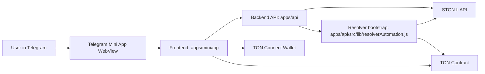

# Architecture

## Product Boundary

This MVP has four runtime parts:

1. Mini App frontend
2. Small backend API
3. Resolver automation
4. TON smart contract

STON.fi is an external dependency for market data, token metadata, and threshold suggestions.

## Request Flow

## Responsibilities

### `apps/miniapp`

Responsible for:

- Telegram Mini App UX
- TON Connect integration
- market list and details screens
- create market form
- bet and claim flows

Should not own:

- price authority
- market resolution logic
- long-lived secret keys

### `apps/api`

Responsible for:

- caching STON.fi data
- serving frontend-friendly read models
- reducing client-side API coupling
- optional indexing of market events

For MVP this can stay very small. It is not the source of truth for bets or outcomes.

### Resolver automation

Responsible for:

- finding markets whose betting window ended
- fetching final reference price
- deciding `YES` or `NO`
- sending `resolve()` onchain

Current production path is:

- bootstrap in [apps/api/src/lib/resolverAutomation.js](../apps/api/src/lib/resolverAutomation.js)
- resolver script in [scripts/autoResolveTonForecastMarket.ts](../scripts/autoResolveTonForecastMarket.ts)

This runtime uses a privileged resolver wallet.

### `contracts`

Responsible for:

- market state
- pools for `YES` and `NO`
- market status
- outcome
- claim protection
- payout calculation

The contract is the source of truth for settlement and claims.

## Market Lifecycle

### Market states

- `OPEN`: accepts new bets
- `LOCKED`: betting closed, waiting for resolver
- `RESOLVED_YES`: settled to yes
- `RESOLVED_NO`: settled to no

Position state is derived per user:

- `OPEN`
- `LOST`
- `WON`
- `CLAIMED`

### Suggested onchain fields

- `marketId`
- `creator`
- `asset`
- `direction`
- `threshold`
- `openUntil`
- `resolveAt`
- `poolYes`
- `poolNo`
- `status`
- `finalPrice`
- `resolvedAt`

### User position fields

- `user`
- `marketId`
- `side`
- `amount`
- `claimed`

## Design Constraint

Use only objective, short-term price markets in MVP:

- assets: `TON`, `STON`, `tsTON`, `UTYA`, `MAJOR`, `REDO`
- durations: `5 min`, `15 min`, `30 min`, `60 min`
- direction in current UI: `above`

No free-form market creation. No subjective outcomes. No governance.

## MVP Vertical Slice

The first full end-to-end slice should be:

1. Frontend shows mocked market cards.
2. Frontend connects wallet.
3. Frontend creates a testnet market.
4. User places a bet.
5. Resolver settles it.
6. Frontend shows claimable state.
7. User claims payout.

Anything not needed for this slice is secondary.
