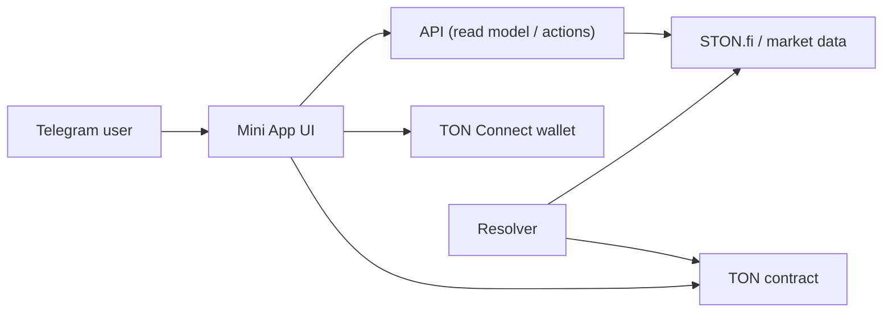
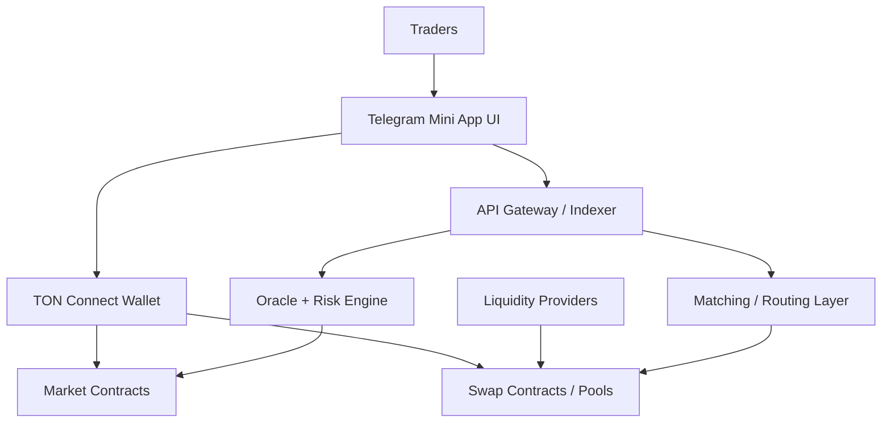

# TonForecast -> dDEX

## 1) Vision

TonForecast starts as a Telegram-native prediction market and evolves into a full decentralized trading product in the TON ecosystem.

- Entry UX: Telegram Mini App + TON Connect
- Core trust layer: onchain contracts
- Data layer: market feeds + resolver/oracle logic
- Target state: full dDEX with real liquidity, composable products, and permissionless participation

---

## 2) Problem We Solve

Most TON users still need:

- Simple mobile-first trading UX inside Telegram
- Fast market discovery for ecosystem assets
- Transparent, onchain settlement with clear rules

TonForecast already validates this behavior with short-term markets (create -> bet -> resolve -> claim).

---

## 3) Product Today (MVP)

Current flow:

1. User opens Mini App in Telegram
2. Connects wallet via TON Connect
3. Creates market on curated assets
4. Bets YES/NO
5. Resolver settles market automatically
6. User claims payout onchain

Supported assets now:

- TON, STON, tsTON, UTYA, MAJOR, REDO

---

## 4) Architecture Today

Four runtime modules:

- `apps/miniapp` - mobile UI in Telegram WebView
- `apps/api` - read model + market actions + external data integration
- `apps/resolver` - auto-resolution worker
- `contracts` - source of truth for pools, status, outcome, and claims

External dependencies:

- STON.fi price feeds
- TON endpoints for chain access

---

## 5) Data & Execution Flow

Key principle:

- UI and API can improve fast
- Contract remains final settlement authority

---

## 6) Infrastructure & Delivery

Current deployment path:

`GitHub -> GitHub Actions -> VPS -> Docker Compose -> Nginx -> https://ton.uxuialex.com`

Operational traits:

- Mobile web delivery with HTTPS for Telegram
- CI-driven deploy on push to `main`
- Isolated container stack (safe with other projects on same server)

---

## 7) Why This Can Become a dDEX

MVP already has foundational dDEX primitives:

- Wallet-native transaction signing
- Onchain settlement logic
- Time-based market lifecycle
- Price-source abstraction
- Resolver automation pipeline

This means the next stage is extension, not rewrite.

---

## 8) Evolution Path: MVP -> dDEX

### Phase A: Stronger Market Engine

- Multi-market registry and indexing
- Better oracle layer (multi-source, fallback, confidence checks)
- Fee accounting + treasury + analytics

### Phase B: Liquidity Layer

- Liquidity providers (LP vaults)
- Dynamic pricing curves / AMM-style pools
- Incentives: LP rewards, fee sharing

### Phase C: Full dDEX Surface

- Spot swaps (AMM or hybrid model)
- Advanced order types (TWAP/limit via keeper flow)
- Aggregation and routing across TON liquidity venues

---

## 9) Target dDEX Architecture (Future)

---

## 10) Security & Reliability Priorities

To be dDEX-grade:

- Contract audits and invariant testing
- Oracle manipulation resistance
- Resolver/keeper decentralization path
- Monitoring + alerting for settlement failures
- Secrets hygiene and strict key management

---

## 11) Business & Growth Direction

- Telegram-native onboarding funnels
- Referral loops and social trading surfaces
- LP incentives and token utility design
- API partner integrations
- Multi-product expansion: prediction + spot + structured markets

---

## 12) Next 90-Day Plan

1. Stabilize current prediction engine (contract + resolver + UI)
2. Launch transparent market analytics panel
3. Add LP-ready pool abstraction in contracts
4. Ship first swap route for curated TON assets
5. Move from "prediction app" to "mobile-first TON dDEX stack"

---

## TL;DR

TonForecast is already a working onchain market product with Telegram-native UX.
The architecture is aligned with a step-by-step transition into a full dDEX without replacing core foundations.
